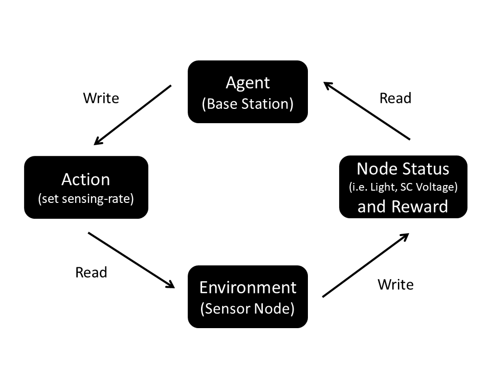

# ACES: Automatic Configuration of Energy Harvesting Sensors with Reinforcement Learning

**Objective:**
ACES uses Reinforcement Learning (RL) with Q Learning to maximize sensing(i.e. temperature monitoring, PIR detection events) while avoiding energy storage depletion. It can be used with any energy harvesting platform that can store some energy for later usage (i.e. super-capacitor, capacitor, battery).

**Wireless Sensor Network Architecture:**
We target single-hop networks where a Master (Computation Unit) interacts directly with a sensor node (Slave) to drive its sensing and collect data. In the Figure below, our wireless sensor network architecture: 

ACES can run in any computational unit that can converge in one day. Therefore, ACES is preferrable to be run in a base station (i.e. Raspberry PI), local server, or cloud. 

In this example, we use ACES with Pible, our custom battery-free mote for perpetual indoor BLE applications. Pible uses a solar panel to gather energy from the environment and a supercapacitor to store it. It can be used for general indoor building applications as it embeds a variety of sensors: temperature, humidity, PIR, reed switch, pressure, accelerometer, gyroscope, microphone, and light.

**How to:**
Run Main_Real.py to start ACES. The system will initially look for an existing Q-Table inside the folder Q_tables. If not found, it will calculate a new Q_Table from scratch. 

To learn a new Q-Table the system needs the last day of lighting levels in lux. If those are not present, the system will automatically use all "0" lighting levels.

In "ID_RL.txt" put the name of your experiment and after the comma put the input state of the RL separated by '|'. By default, the system is using the supercapacitor voltage level (i.e. SC_norm), light (i.e. Light) and week/weekend day (i.e. week) as observations.
